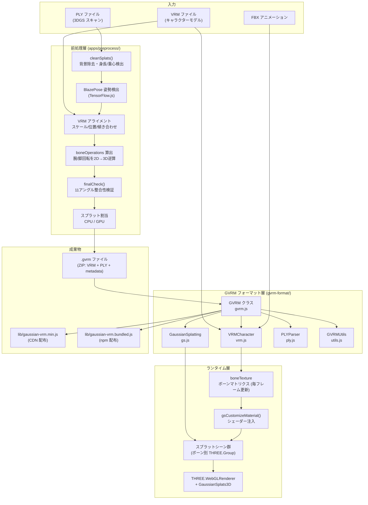
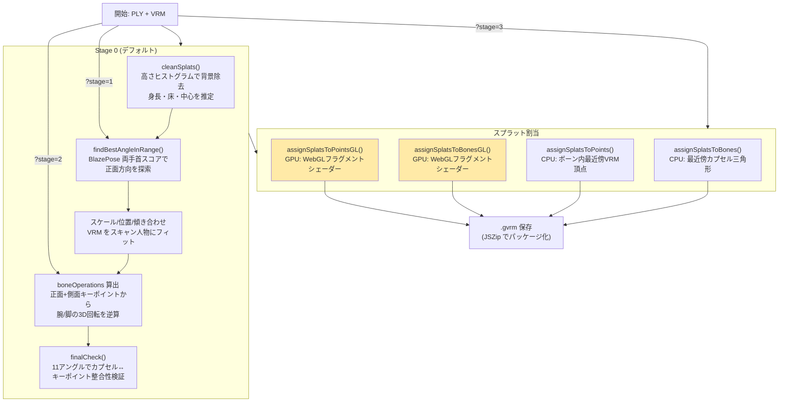
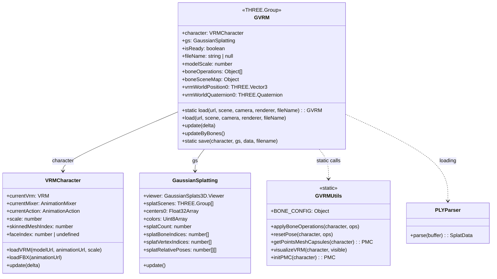
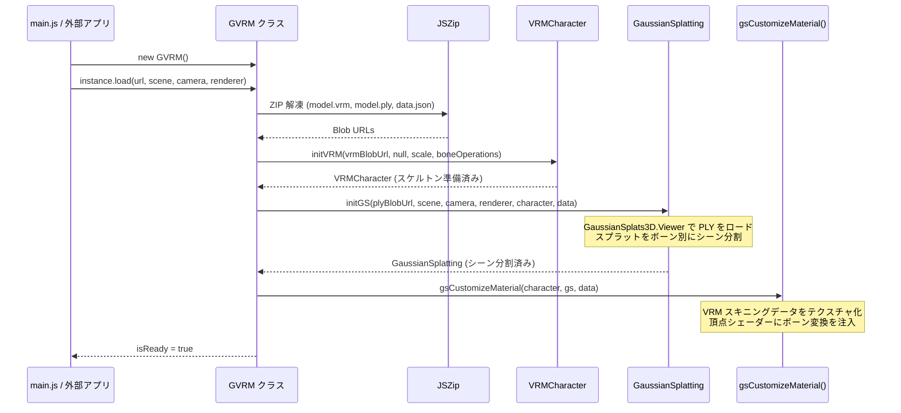
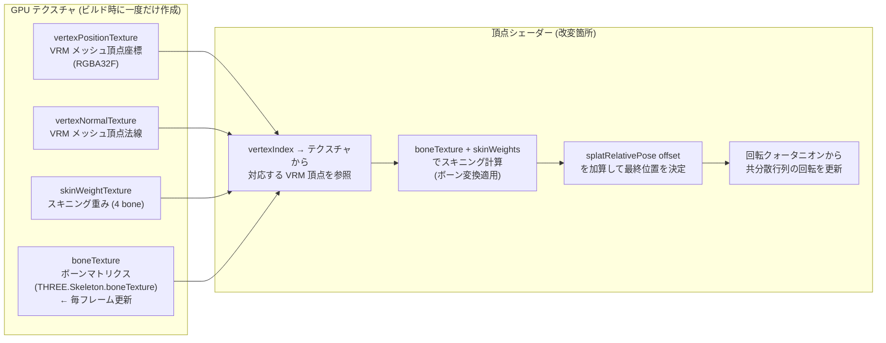
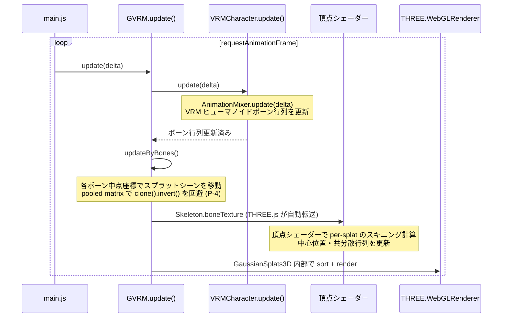
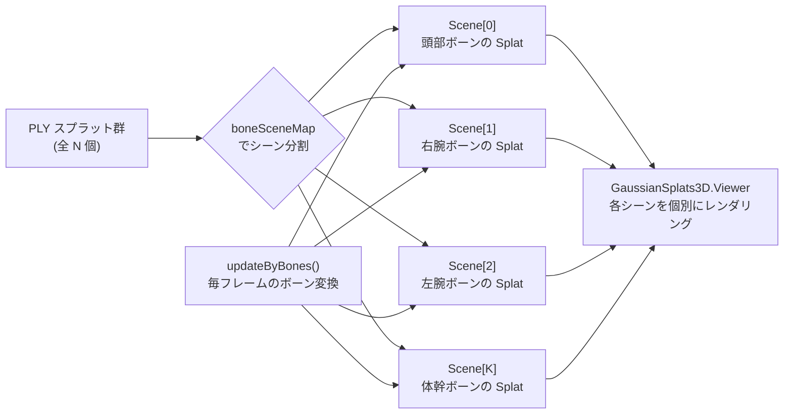

# Architecture Reference Document — gaussian-vrm

## 概要

gaussian-vrm は、3D Gaussian Splatting (3DGS) のスプラット点群と VRM キャラクターモデルを組み合わせ、スケルタルアニメーション対応のフォトリアリスティックアバターを生成・表示する Web アプリ兼ライブラリです。

システムは大きく 3 フェーズで構成されます。

| フェーズ | 内容 | 担当コード |
|---------|------|----------|
| **前処理** | PLY スキャン + VRM → `.gvrm` ファイルを生成 | `apps/preprocess/` |
| **ローディング** | `.gvrm` を解凍・デシリアライズし GPU テクスチャ + シェーダーを準備 | `gvrm-format/gvrm.js` |
| **ランタイム** | フレームごとにボーン変換をシェーダーへ供給し Splat を骨格に追従させてレンダリング | `gvrm-format/gvrm.js`, `main.js` |

---

## 1. 全体コンポーネント構成



---

## 2. GVRM ファイルフォーマット

`.gvrm` は ZIP アーカイブで、以下の 3 ファイルを含みます。

```
model.gvrm (ZIP)
├── model.vrm    — VRM 1.0 キャラクターモデル
├── model.ply    — Gaussian Splat 点群 (位置・色・共分散データ)
└── data.json    — バインドメタデータ
```

**`data.json` の主要フィールド:**

| フィールド | 型 | 説明 |
|---|---|---|
| `splatVertexIndices` | `number[]` | 各スプラットが追従する VRM メッシュ頂点のインデックス |
| `splatBoneIndices` | `number[]` | 各スプラットが割り当てられたボーンのインデックス |
| `splatRelativePoses` | `number[]` | 各スプラットのバインド頂点からの相対位置ベクトル |
| `boneOperations` | `Object[]` | VRM スケルトンに適用するポーズ調整（`boneName`, `position`, `rotation`） |
| `modelScale` | `number` | VRM モデルスケール係数（PLY スキャンの身長から自動算出） |

---

## 3. 前処理パイプライン

PLY スキャンデータを GVRM に変換する処理フロー（`apps/preprocess/`）。  
アルゴリズムの詳細は [docs/algorithm-overview.md](./algorithm-overview.md) を参照。



**ステージパラメータ（`?stage=N`）:**

| stage | スキップされる処理 | ユースケース |
|-------|-----------------|------------|
| 0 (デフォルト) | なし | 完全自動処理 |
| 1 | cleanSplats | 清浄済み PLY を再利用 |
| 2 | cleanSplats + 姿勢検出 | アライメント検証済みの場合 |
| 3 | 自動検出を全スキップ | 手動パラメータ指定 |

**エラー ID 一覧:**

| ID | 発生箇所 | 原因 |
|----|---------|------|
| 1 | pose.js | 特定角度でのポーズ検出失敗 |
| 2 | preprocess.js | キャラクター向き検出失敗 |
| 3 | preprocess.js | 地面検出失敗（膝が地面より下） |
| 4 | preprocess.js | A-pose 検証失敗（手が内側に曲がっている） |
| 5 | preprocess.js | 重心計算での頂点未検出 |
| 6 | preprocess.js | 高さ計算でのターゲット検出失敗 |

---

## 4. ランタイム: クラス構成



**`skinnedMeshIndex` について:**  
VRM モデルによってスキニングメッシュの位置が異なります。通常は `1`、メッシュ数の多いモデルでは `2` になる場合があります。新しい VRM モデルを追加する際は `gvrm.js:initVRM()` の判定ロジックを確認してください。

---

## 5. ロードシーケンス



---

## 6. カスタムシェーダー注入 (`gsCustomizeMaterial()`)

`gvrm-format/gvrm.js` の `gsCustomizeMaterial()` (L533–L776) は GaussianSplats3D の内部 WebGL シェーダーを改変してスケルタルアニメーションを実現します。



**シェーダー変数の対応:**

| GPU テクスチャ / uniform | 用途 |
|---|---|
| `vertexPositionTexture` | バインドポーズ時の VRM メッシュ頂点座標 |
| `boneTexture` | VRM Skeleton から毎フレーム転送されるボーンマトリクス |
| `skinWeightTexture` | 各頂点の 4 ボーンスキニング重み |
| `splatRelativePose` | バインド時の頂点→スプラット相対ベクトル（`data.json` より） |

**制約:**
- GS3D (`lib/gaussian-splats-3d.module.js`) のバージョンを変更した場合、シェーダー変数名の互換性を必ず確認すること
- `updateByBones()` はボーン中点の **位置** のみ更新。**回転** はシェーダー内で処理される

---

## 7. フレームループ



`updateByBones()` の内部処理 (`gvrm.js` L314〜):

```
for each ボーン in skeleton.bones:
  if 子ボーンなし: skip
  for each 子ボーン:
    midPoint = (bone.matrixWorld + childBone.matrixWorld) / 2
    midPoint.applyMatrix4(gsViewerMatrixWorldInverse)       ← GS ビューア局所座標へ変換
    _invMat0.copy(childBone.matrixWorld0).invert()          ← バインドポーズの逆行列 (pooled)
    _relMat.multiplyMatrices(childBone.matrixWorld, _invMat0) ← 相対回転
    tempQuat.setFromRotationMatrix(_relMat)
    splatScene.position = midPoint
    splatScene.quaternion = tempQuat × gsViewerWorldQuatInverse
```

---

## 8. スプラットシーン分割方式

GaussianSplats3D は通常 1 つのシーンでスプラットを管理しますが、gaussian-vrm は**ボーンごとに `THREE.Group` シーンを分割**してボーン追従を実現します。



---

## 9. ビルドパイプライン


| 成果物 | 用途 | GS3D 依存 |
|---|---|---|
| `lib/gaussian-vrm.min.js` | CDN 経由（`examples/simple-viewer.html` など） | ユーザー側で読み込み |
| `lib/gaussian-vrm.bundled.js` | npm パッケージ（`@naruya/gaussian-vrm`） | 同梱済み |

---

## 10. PMC (Points / Mesh / Capsules) デバッグシステム

前処理・開発時のスプラット割当デバッグ用可視化システム。

| 要素 | 説明 |
|------|------|
| **Points** | VRM メッシュ頂点のワールド座標（点群表示） |
| **Mesh** | VRM メッシュワイヤーフレーム |
| **Capsules** | ボーン形状カプセル（ボーン色でスプラット割当を確認） |

**キーボード操作:**

| キー | 操作 |
|------|------|
| `V` | PMC 表示切替 |
| `C` | スプラット色モード切替（empty → assign → original） |
| `X` | VRM メッシュ表示切替 |
| `Space` | アニメーション再生/一時停止 |

---

## 11. 座標系・スケール

| 空間 | 座標系 | 備考 |
|------|--------|------|
| VRM | Y-up 右手系 | Three.js 標準 |
| 3DGS (PLY) | Y-up 右手系 | VRM と一致させる |
| スクリーン空間 | 正規化（高さで除算） | finalCheck の比較に使用 |

VRM スケール自動算出:

```
vrmScale = (heights.max - heights.min) / (-character.ground * 2 + 0.05)
```

スキャン人物の身長と VRM のバウンディング高さの比から決定し、`data.json` の `modelScale` に保存されます。

---

## 12. ファイル構成

```text
gaussian-vrm/
├── gvrm-format/                  ライブラリコア（npm 配布対象）
│   ├── gvrm.js                   GVRM クラス: ロード/保存/ランタイム更新/シェーダー注入
│   ├── vrm.js                    VRMCharacter: VRM ロード・FBX アニメーション
│   ├── gs.js                     GaussianSplatting: GS3D ビューアラッパー
│   ├── ply.js                    PLYParser: PLY ファイルパーサー
│   └── utils.js                  GVRMUtils: ボーンカプセル生成・ボーン操作・PMC
├── apps/                         アプリ固有コード（ライブラリに含まれない）
│   ├── preprocess/               前処理パイプライン
│   │   ├── preprocess.js         メインパイプライン (Stage 0–3)・CPU Splat 割当
│   │   ├── preprocess_gl.js      GPU 加速 Splat 割当 (WebGL コンピュートシェーダー)
│   │   ├── pose.js               TensorFlow.js BlazePose ラッパー
│   │   ├── check.js              finalCheck（マルチアングル整合性検証）
│   │   └── utils_gl.js           WebGL ユーティリティ
│   └── avatarworld/              マルチアバターデモアプリ
│       ├── main.js               エントリポイント
│       ├── walker.js             自律歩行 AI
│       └── scene.js              環境生成（空・床・建物）
├── lib/                          ビルド成果物（直接編集禁止）
│   ├── gaussian-vrm.min.js       CDN 配布ビルド
│   ├── gaussian-vrm.bundled.js   npm 配布ビルド
│   └── gaussian-splats-3d.module.js  GS3D サードパーティライブラリ
├── assets/                       サンプル GVRM・FBX アニメーション・default.json
├── examples/                     simple-viewer.html（外部利用サンプル）
├── tests/                        vitest 単体テスト
│   └── unit/                     UT-13（ソースパターン）・UT-14（リファクタ/パフォーマンス）
├── docs/
│   ├── algorithm-overview.md     アルゴリズム詳解（本ドキュメント補足）
│   └── algorithm-overview.js     疑似コードによるアルゴリズム解説
├── main.js                       メインアプリエントリポイント
├── index.html                    メインアプリ HTML
├── server.js                     HTTPS 開発サーバー (localhost:8080)
└── build.js                      esbuild ビルドスクリプト
```

---

## 関連ドキュメント

| ドキュメント | 内容 |
|---|---|
| [docs/algorithm-overview.md](./algorithm-overview.md) | 前処理アルゴリズムの詳細解説（ボーン推定・Splat 対応付け） |
| [docs/algorithm-overview.js](./algorithm-overview.js) | 疑似コードによるアルゴリズム詳解 |
| [AGENTS.md](../AGENTS.md) | エージェント定義・non-negotiable 制約 |
| [CLAUDE.md](../CLAUDE.md) | 開発コマンド・URL パラメータ・キーボード操作リファレンス |
| [docs/algorithm-improvements.md](./algorithm-improvements.md) | アルゴリズム改善候補一覧 |
