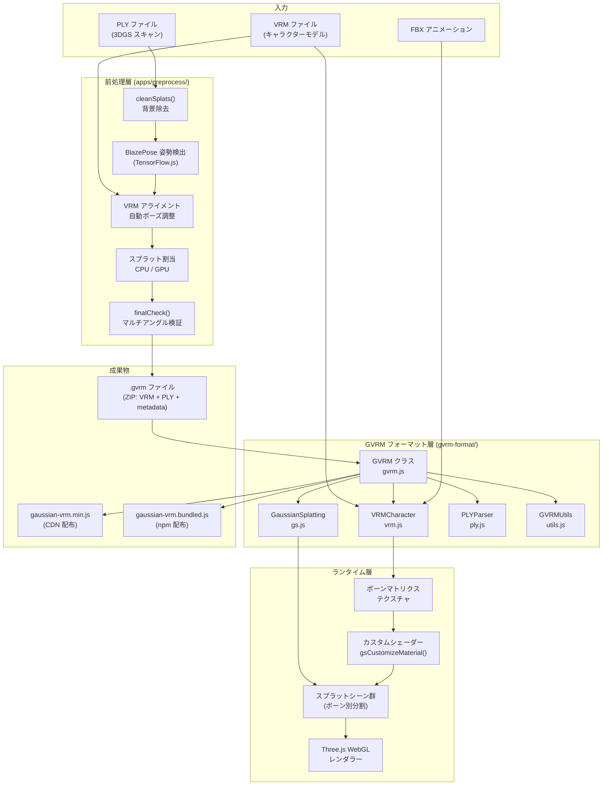
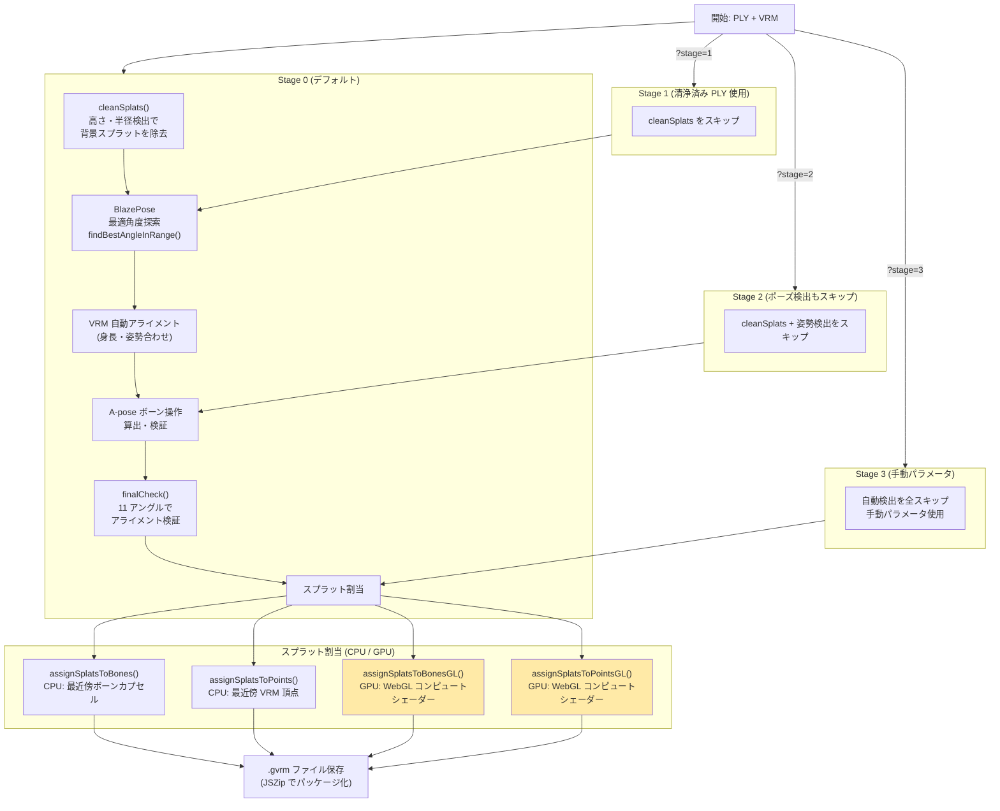
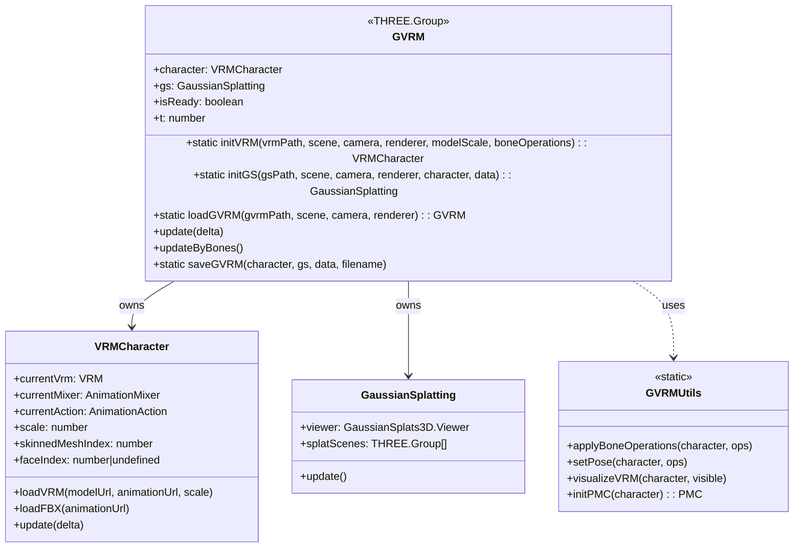
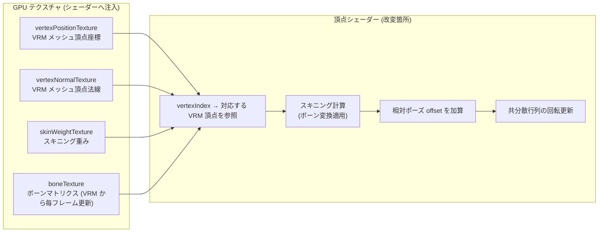
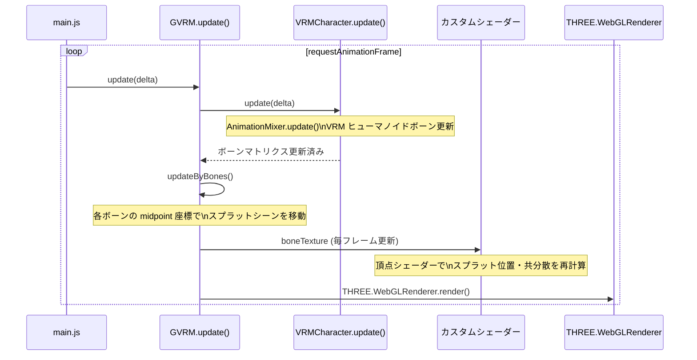
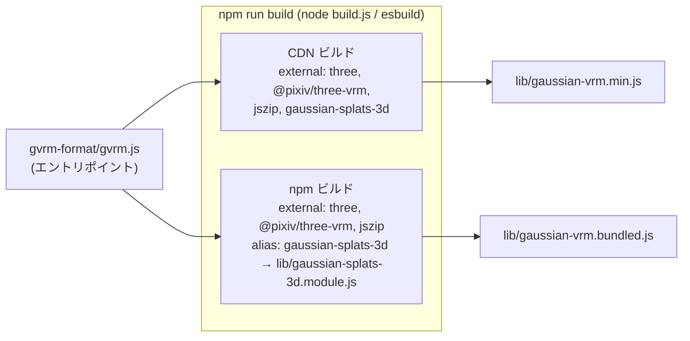

# Architecture Reference Document — gaussian-vrm

## 概要

gaussian-vrm は、3D Gaussian Splatting (3DGS) のスプラット点群と VRM キャラクターモデルを組み合わせ、スケルタルアニメーション対応のフォトリアリスティックアバターを生成・表示する Web アプリ兼ライブラリです。

システムは大きく 3 フェーズで構成されます:

1. **前処理フェーズ** — PLY スキャンデータと VRM モデルを入力とし、バインドメタデータを生成して `.gvrm` ファイルを出力する
2. **ローディングフェーズ** — `.gvrm` ファイルを解凍・デシリアライズし、GPU テクスチャ + シェーダーを準備する
3. **ランタイムフェーズ** — フレームごとにボーン変換をシェーダーへ供給し、スプラットを骨格に追従させてレンダリングする

---

## 1. 全体コンポーネント構成



---

## 2. GVRM ファイルフォーマット

`.gvrm` は ZIP アーカイブで、以下の 3 ファイルを含む:

```
model.gvrm (ZIP)
├── model.vrm    — VRM 1.0 キャラクターモデル
├── model.ply    — Gaussian Splat 点群 (位置・色・共分散データ)
└── data.json    — バインドメタデータ
```

**`data.json` の主要フィールド:**

| フィールド | 型 | 説明 |
|---|---|---|
| `splatVertexIndices` | `number[]` | 各スプラットが最近傍の VRM メッシュ頂点のインデックス |
| `splatBoneIndices` | `number[]` | 各スプラットが割り当てられたボーンのインデックス |
| `splatRelativePoses` | `number[]` | 各スプラットのバインド頂点からの相対位置 |
| `boneOperations` | `Object[]` | VRM スケルトンに適用するポーズ調整 (`boneName`, `position`, `rotation`) |
| `modelScale` | `number` | VRM モデルスケール係数 |

---

## 3. 前処理パイプライン

PLY スキャンデータを GVRM に変換する処理フロー (`apps/preprocess/`):



**エラー ID 一覧** (`[ErrorID N]` で検索可能):

| ID | 発生箇所 | 原因 |
|----|---|---|
| 1 | pose.js | 特定角度でのポーズ検出失敗 |
| 2 | preprocess.js | キャラクター向き検出失敗 |
| 3 | preprocess.js | 地面検出失敗（膝が地面より下） |
| 4 | preprocess.js | A-pose 検証失敗（手が内側に曲がっている） |
| 5 | preprocess.js | 重心計算での頂点未検出 |
| 6 | preprocess.js | 高さ計算でのターゲット検出失敗 |

---

## 4. ランタイム: クラス構成



---

## 5. ランタイム: カスタムシェーダー注入

`gsCustomizeMaterial()` (`gvrm-format/gvrm.js:533-776`) は Gaussian Splats 3D の内部 WebGL シェーダーを改変してスケルタルアニメーションを実現する:



**シェーダー注入の制約:**
- GS3D (`gaussian-splats-3d.module.js`) のバージョンを変更した場合、シェーダー変数名の互換性を必ず確認すること
- `updateByBones()` はボーン中点の **位置** のみ更新。**回転** はシェーダー内で処理される

---

## 6. フレームループ



---

## 7. ビルドパイプライン



| 成果物 | 用途 | GS3D 依存 |
|---|---|---|
| `lib/gaussian-vrm.min.js` | CDN 経由での利用 | 外部依存（ユーザー側で読み込み） |
| `lib/gaussian-vrm.bundled.js` | npm パッケージ | 同梱済み |

---

## 8. PMC (Points/Mesh/Capsules) デバッグシステム

前処理・開発時のスプラット割当デバッグ用の可視化システム:

| 要素 | 説明 | 表示切替 |
|---|---|---|
| **Points** | VRM メッシュ頂点のワールド座標 | `V` キー |
| **Mesh** | VRM メッシュワイヤーフレーム | `V` キー |
| **Capsules** | ボーン可視化（ボーン色でスプラット割当を確認） | `V` キー |

スプラット色モード切替: `C` キー (empty → assign → original)

---

## 9. 座標系・スケール

- **VRM**: Y-up 右手系
- **3DGS (PLY)**: VRM に合わせた Y-up 右手系（一般的）
- **スクリーン空間**: ポーズ検出の検証に使用（高さで正規化）
- **VRM スケール**: PLY スキャンの高さから自動計算される（`modelScale` フィールドに保存）
